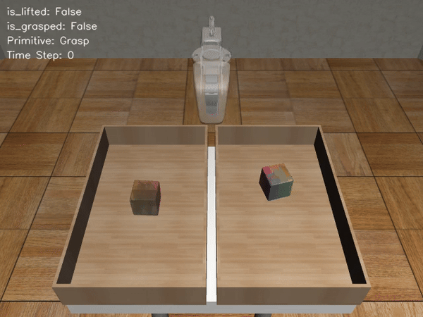

# <a href="https://sgmp-rss2024.github.io/">HACMan++: Spatially-Grounded Motion Primitives for Manipulation</a>
<p align="center">
  
</p>


[Website](https://sgmp-rss2024.github.io/) | [Arxiv](https://arxiv.org/pdf/2407.08585)

  <a href="https://jiangbowen0008.github.io/">Bowen Jiang*</a>, 
  <a href="https://yilin-wu98.github.io/">Yilin Wu*</a>, 
  <a href="https://wenxuan-zhou.github.io/">Wenxuan Zhou</a>, 
  <a href="https://cpaxton.github.io/about/">Chris Paxton</a>, 
  <a href="https://davheld.github.io/">David Held</a>

Code Release for HACMan++.

Please feel free to open an issue or email us at {yilinwu, bowenj}@andrew.cmu.edu if you have any questions.

## Table of Contents
- [HACMan++ Code Release](#hacman-spatially-grounded-motion-primitives-for-manipulation)
  - [Table of Contents](#table-of-contents)
- [ Installation](#installation)
  - [Install HACMan++ DoubleBin Env](#install-hacman-doublebin-env-dependencies)
  - [Install Other dependencies](#install-other-dependencies)
  - [Simple Test to Visualize the DoubleBin Env](#simple-test-to-visualize-the-doublebin-environment-with-primitives)
  - [Simple Test to Visualize the ManiSkill2 Env](#simple-test-to-visualize-the-maniskill-environment-with-primitives)
  - [Configure WandB logging](#configure-wandb-logging)
- [Usage](#usage)
  - [Quick Start](#quick-start)
  - [Training HACMan++ on ManiSkill2Env](#running-experiments-of-hacman-on-maniskill2-env)
  - [Training HACMan++ on HACMan++DoubleBinEnv](#running-experiments-of-hacman-on-hacmandoublebinenv)
  - [Training HACMan++ on Robosuite Env](#running-experiments-of-hacman-on-robosuite-env)
  - [Evaluation](#evaluation)
- [Development](#development)
  - [Code Structure](#code-structure)
  - [Adding New Environments](#adding-new-environments)
  - [Explanation of the hybrid policy](#explanation-of-the-hybrid-policy)
  - [Explanation of the motion primitives](#explanation-of-the-motion-primitives)
  - [Explanation of the environment wrappers](#explanation-of-the-environment-wrappers)
- [Acknowledgement](#acknowledgement)
- [Code Licence](#code-licence)
- [Citation](#citation)


# Installation

First, clone the github repo and the submodules
```
git clone 
git submodule update --init --recursive
```

Second, install the conda environment:
```
conda create --name hacman python=3.8
conda activate hacman
```

Install setuptools
```
pip install setuptools==65.5.0 "wheel<0.40.0" # because of gym 0.21 issue https://github.com/openai/gym/issues/3176.

```

Install `Pytorch 1.11.0 + cu113`. Note: the compatibility with other Pytorch version has not been tested.
```
pip install torch==1.11.0+cu113 torchvision==0.12.0+cu113 torchaudio==0.11.0 --extra-index-url https://download.pytorch.org/whl/cu113
```

Install the following packages with **THE SPECIFIED VERSIONS**:
```
# Torch Geometric
pip install torch-scatter==2.0.9 -f https://data.pyg.org/whl/torch-1.11.0+cu113.html
pip install torch-sparse==0.6.15 -f https://data.pyg.org/whl/torch-1.11.0+cu113.html
pip install torch-geometric==2.0.4
pip install torch-cluster==1.6.0 -f https://data.pyg.org/whl/torch-1.11.0+cu113.html
```


## Install HACMan++ DoubleBin Env Dependencies

`HACMan++DoubleBinEnv` runs tasks shown in our paper. Running this simulation environment requires Mujoco and Robosuite

Install `mujoco-py`.
```
wget https://mujoco.org/download/mujoco210-linux-x86_64.tar.gz
mkdir ~/.mujoco
tar -xvzf mujoco210-linux-x86_64.tar.gz -C ~/.mujoco
## for mujoco_py compilation
pip install 'cython<3' 
sudo apt install libosmesa6-dev libgl1-mesa-glx libglfw3 libglew-dev patchelf

## Add the following three path to the ~/.bashrc 
export LD_LIBRARY_PATH=$LD_LIBRARY_PATH:/home/yilinwu/.mujoco/mujoco210/bin
export LD_LIBRARY_PATH=$LD_LIBRARY_PATH:/usr/lib/nvidia
export CPATH=$CONDA_INCLUDE/prefixd

source ~/.bashrc
```
Test the installation of mujoco_py

```
python 
  import mujoco_py
```
If no errors after compilation, the mujoco_py should be installed correctly.

Otherwise, please see the mujoco_py Documentation [here](https://github.com/openai/mujoco-py?tab=readme-ov-file#ubuntu-installtion-troubleshooting)

## Install other dependencies

Install the requirements.txt
```
pip install -r requirements.txt
```

Install this package hacman:
```
pip install -e .
```

## Simple Test to Visualize the DoubleBin Environment with Primitives

<p align="center">
  
</p>

```
cd hacman_bin
## a video should be saved in hacman_bin/videos folder after running the following command
MUJOCO_PY_FORCE_CPU=1 python make_bin_vec_env.py
```
## Simple Test to Visualize the Maniskill Environment with Primitives
```
cd hacman_ms
## a video should be saved in hacman_ms/videos folder after running the following command
LD_PRELOAD='' DISPLAY='' python make_ms_vec_env.py
```

## Configure WandB logging

Our training script is based on [stablebaselines3](https://github.com/DLR-RM/stable-baselines3), which supports logging with [Weight & Bias](https://wandb.ai/home).

If you do not wish to use WandB, you can turn off streaming by running `wandb off` from your training directory, or setting the environment variable `WANDB_MODE=offline`.

To configure the WandB logging function, set the following environment variables. 
```
export WANDB_ENTITY=[your Wandb ID]
export WANDB_PROJECT=[your project name]
```


# Usage


- To reproduce the training curve in the paper, see [Running Experiments of HACMAN++ On ManiSkill2 Env](#running-experiments-of-hacman-on-maniskill2-env), [Running Experiments of HACMan++ on HACMan++DoubleBinEnv](#running-experiments-of-hacman-on-hacmandoublebinenv) and [Running Experiments of HACMan++ on Robosuite Env](#running-experiments-of-hacman-on-robosuite-env)

Note: if you have correctly configured your WandB logging, you should be able to see the training curve for any of the following training task on your W&B project page (note: change x-axis to `global step`).


## Quick Start

We have put the configuration files for each task in the folder scripts/configs/experiments. 

To launch a task, the command should follow the following format. 

If you want to launch the experiments locally, you can use argument `cluster=local`. Otherwise, you need to first name the `CLUSTER_ADDRESS`, `CLUSTER_NAME` in the launch.py and use the arugment `cluster=CLUSTER_NAME` to launch the experiment on a slurm server with singularity.

 The `ExpID` and `ExpGroup` argument is used to help you organize the experiments on the WanDB. 

 The `experiments` argument should be any of the config file under scripts/configs/environments without the extension (e.g., ms_lift_cube). 
 
 The `n_seeds` is used to specify the number of seeds to run.
 
 The `user` is used to specify the username if you want to run it on the cluster. 

```
python scripts/launch.py ExpID=xxx ExpGroup=xxx +experiments=/name/of/config/file cluster=local/CLUSTER_NAME ++n_seeds=/number/of/seeds ++user=/name/of/the/user
```


## Running Experiments of HACMAN++ On ManiSkill2 Env

**Important: make sure you have tested the installation of the [ManiSkill2Env](#simple-test-to-visualize-the-maniskill-environment-with-primitives).**

The following launch command converts the config file into the actual command for the HACMan++ training on the task "Stack Cube MS2". 

You should copy the whole output and execute it in the terminal. 

If everything is configured correctly, you should expect a success rate of ~100% at 66k training steps but we do notice there might be some variance across different seeds.
```
python scripts/launch.py ExpID=9999 ExpGroup=ms_stack_cube_test +experiments=ms_stack_cube cluster=local ++n_seeds=1
```

## Running Experiments of HACMAN++ On Robosuite Env


The following launch command converts the config file into the actual command for the HACMan++ training on the task "Robosuite Door Opening". 

You should copy the whole output and execute it in the terminal. 

If everything is configured correctly, you should expect a success rate of ~100% at 250k training steps.

```
python scripts/launch.py ExpID=9999 ExpGroup=robosuite_door_opening_test +experiments=suite_door cluster=local ++n_seeds=1
```

## Running Experiments of HACMan++ on HACMan++DoubleBinEnv

**Important: make sure you have tested the installation of the [HACMan++BinDoubleEnv](#simple-test-to-visualize-the-doublebin-environment-with-primitives).**


The following launch command converts the config file into the actual command for HACMan++ training on the task `HACManDoubleBinEnv` with only the cube object.

You should copy the whole output and execute it in the terminal. 

If everything is configured correctly, you should expect a success rate of ~80% after 300k training steps but we do notice there might be some variance across different seeds. 

This is a simplified version of our DoubleBin task in our paper with only the cube object but it is a quick experiment to run to reproduce the result. 

```
python scripts/launch.py ExpID=9999 ExpGroup=double_bin_cube_test +experiments=double_bin_cube_6d cluster=local ++n_seeds=1
```

To reproduce the original DoubleBin Task in the paper, run the following commands, executes the output and it takes much longer to train. 

```
python scripts/launch.py ExpID=9999 ExpGroup=double_bin_all_test +experiments=double_bin_all_6d cluster=local ++n_seeds=1
```

## Evaluation

**Important: make sure you have tested the installation of the [HACMan++BinDoubleEnv](#simple-test-to-visualize-the-doublebin-environment-with-primitives).**

The following command evaluates a trained HACMan++ policy for 20 episodes. You can run the following command to evaluate the policy.

```
LD_PRELOAD="" MUJOCO_PY_FORCE_CPU=1 python scripts/run.py --name default --env hacman --load_dirname logs/hacman --dirname results --ExpID 1001 --load_exp Exp9999 --eval 20 --eval_n_envs 10
```

To render the videos, add the following arguments
```
--record_video 
```

# Development

## Code Structure
- `docs`: Documentation files
- `hacman`
  - `algos`
    - `feature_extractors`
      - `feature_extractors.py`: Networks for extracting features from point clouds
    - `hacman_td3.py`: HACMan hybrid TD3 implementation
    - `location_policy.py`: Location policy implementation. Location policies score per-point actions and select the best point to execute the action.
    - `mix_td3.py`: An ablation implementation of HACMan TD3.
    - `setup_model.py`: Model setup functions.
  - `envs`
    - `sim_envs`
      - `base_env.py`: Base class for simulation environments used by HACMan.
      - `simple_env.py`: Simple 2D tabletop cube pushing environment.
      - `hacman_bin_env.py`: HACMan Bin environment.
    - `location_policy_wrappers.py`: Wrappers for location policy used in env. Location policy is included in the env wrapper since we add contact point index part to be part of the environment observation. 
    - `wandb_wrappers.py`: WandB logging wrappers.
    - `setup_envs.py`: Environment setup functions.
    - `setup_location_policy.py`: Location policy setup functions.
  - `networks`
    - `common.py`: Common network modules.
    - `point_transformer.py`: Point Transformer implementation.
    - `pointnet2.py`: PointNet++ implementation.
  - `sb3_utils`: Stable Baselines 3 utilities.
    - ...
  - `utils`
    - `launch_utils.py`: Utility functions for launching training.
    - `plotly_utils.py`: Utility functions for plotting 3D PCD visualizations.
    - `robosuite_transform_utils.py`: Utility functions used by `transformations.py`. Copied from `robosuite`.
    - `transformations.py`: Utility functions for transforming 3D PCDs.
- `scripts`
  - `test_simple_env.py`: Test script for `SimpleEnv`.
  - `run.py`: Training script.
- `bin_env`
  - `assets`: Assets used by `HACManBinEnv`.
    - `housekeep`: Cylindrical housekeep objects.
    - `housekeep_all`: All housekeep objects.
    - ...
  - `controller_configs`: Controller configuration files.
  - `data`
    - `housekeep`: Goal pose data for cylindrical housekeep objects.
    - `housekeep_all`: Goal pose data for all housekeep objects.
  - `base_env.py`: Base environment. It contains initialization functions for the environment and object loading functions.
  - `bin_arena.py`: Bin workspace.
  - `osc.py`: Controller for controlling robot arm via operational space control.
  - `poke_env.py`: Top-level sim environment directly used by `HACManBinEnv`. It contains functions for interacting with the environment, resetting the environment, and setting goals.
  - ...


## Adding New Environments

To add a new environment, you need to implement the functions in `hacman/envs/sim_envs/base_env.py`. See `hacman/envs/sim_envs/simple_env.py` for an example. Afterwards, add the new environment to `hacman/envs/setup_envs.py`.


## Explanation of the hybrid policy

In the paper, we propose a hybrid action space with a discrete component (action location) and a continuous component (motion parameters). Unfortunately, Stable baselines3 does not support hybrid action space. We design a workaround to incorporate the hybrid action space into Stable baselines3 that can be combined with existing continuous action space algorithms with minimal modifications.

The main idea is to include the discrete part of the policy (location policy) into the environment as an environment wrapper. As illustrated in the figure below, the raw output of env.step will be passed into a location policy wrapper (implemented as SubprocVecEnvwithLocationPolicy or DummyVecEnvwithLocationPolicy in `hacman/envs/location_policy_wrappers.py`). The location policy then selects the discrete action based on the current model and appends the action as `poke_idx` into the observation. Then, the full observation, including the original observation and `poke_idx`, will be passed into the RL algorithm of Stable baseline3. In addition, we pass the `poke_idx` back to the simulation environment by `set_prev_obs` to be used for the next `env.step`. In this way, the discrete component of the policy is off-loaded into the environment and we can use any algorithm with continuous action space seamlessly.

Note that the wrappers in `hacman/envs/location_policy_wrappers.py` serve as a connection between the environment and the wrapper. The actual "policy" (how we select the discrete action) is defined as `LocationPolicyWithArgmaxQ` in `hacman/algos/location_policy.py`. 

## Explanation of the Motion Primitives
In the paper, we propose a generic set of motion primitives for manipulation. The library of motion primitives are 'Poke', 'Move to', 'Move by', 'Grasp', 'Open Gripper'. The detailed explantion of the primitives can be seen in the paper Section III.B.  Although all the tasks share the same high-level design of these primitives, the low-level implementation is different because different simulation environments have different interfaces. Therefore, we have different primitive definition files for ManiSkill2 (`/hacman_ms/env_wrappers/primitives.py`), Robosuite (`hacman_suite/env_wrappers/primitives.py`)and DoubleBinEnv (`hacman_bin/primitives.py`). 

Each primitive file has defined a default class of Primitive (e.g., `BinPrimitive`, `MSPrimitive`,`SuitePrimtive`) that has the base functions like `move_to` that can be used to compose more complicated motions of the primitive. Then for each primitive, it inherits the base class and define its own `execute` function to complete the primitive's motion. It also has `is_valid` function to check the pre-condition of the primitive and `visualize` function to define how primitive is visualized in the plotly.

## Explanation of the environment wrappers

This section presents the complete list of environment wrappers employed in this project.

Environment wrappers' order: 
```
VecEnvwithLocationPolicy<[NUM_ENVS * <Monitor<TimeLimit<Env>>]>
```

For evaluation, we add one more wrapper `WandbPointCloudRecorder` on top to record the point cloud visualizations or video footages.

1. `SubprocVecEnvwithLocationPolicy`/`DummyVecEnvwithLocationPolicy`. 
    
    This wrapper embeds the location policy into the environment. It is utilized for both parallel and non-parallel training, where SubprocVecEnvwithLocationPolicy is used for parallel training, and DummyVecEnvwithLocationPolicy is employed for non-parallel training (useful for debugging). These wrappers incorporate the policy model to calculate the poke_idx and action_score, which are appended to the observation using set_prev_obs, as described in the previous section. The poke_idx determines the point where the action is executed, while the action_score is used for logging. The implementations of these wrappers can be found in `hacman/envs/location_policy_wrappers.py`.
2. `Monitor`. 
   
   This wrapper logs the agent's performance during training, providing information on episode reward, episode length, and episode time. These values are subsequently uploaded to wandb. The implementation is imported from `stable_baselines3.common.monitor`.

3. `TimeLimit`. 
   
   This wrapper limits the maximum number of steps per episode. When the episode reaches the maximum number of steps, it sets done to True. The implementation is imported from `gym.wrappers.time_limit`.

4. `WandbPointCloudRecorder`.
   
   This wrapper is used to record and generate point cloud visualizations of episodes and upload them to wandb. Please note that only the first of the parallel environments will have point cloud visualizations. Additionally, it records video footages if enabled. The implementation can be found in `hacman/envs/wandb_wrappers.py`.

# Citation

```
@inproceedings{jiang2024hacmanpp,
  title     = {HACMan++: Spatially-Grounded Motion Primitives for Manipulation},
  author    = {Jiang, Bowen and Wu, Yilin and Zhou, Wenxuan and and Paxton, Chris and Held, David},
  journal   = {Robotics: Science and Systems},
  year      = {2024},
}
```
